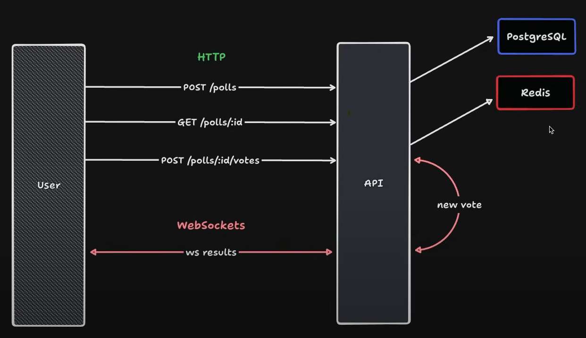

# OnlinePoll

> Um sistema de votação em tempo real onde os usuários podem criar uma enquete e outros usuários podem votar. O sistema gera um ranking entre as opções e atualiza os votos em tempo real.

## 📈 Diagrama



## ⚙️ Setup

- Clone o repositório;
- Instalar dependências (`npm install`);
- Configurar PostgreSQL e Redis (`docker compose up -d`);
- Executar aplicação (`npm run dev`);

## 🌏 HTTP

### POST `/polls`

Criar uma nova enquete.

#### Request body

```json
{
  "title": "Qual a melhor linguagem de programação?",
  "options": [
    "JavaScript",
    "Java",
    "PHP",
    "C#"
  ]
}
```

#### Response body

```json
{
  "pollId": "194cef63-2ccf-46a3-aad1-aa94b2bc89b0"
}
```

### GET `/polls/:pollId`

Retornar dados de uma única enquete.

#### Response body

```json
{
	"poll": {
		"id": "e4365599-0205-4429-9808-ea1f94062a5f",
		"title": "Qual a melhor linguagem de programação?",
		"options": [
			{
				"id": "4af3fca1-91dc-4c2d-b6aa-897ad5042c84",
				"title": "JavaScript",
				"score": 1
			},
			{
				"id": "780b8e25-a40e-4301-ab32-77ebf8c79da8",
				"title": "Java",
				"score": 0
			},
			{
				"id": "539fa272-152b-478f-9f53-8472cddb7491",
				"title": "PHP",
				"score": 0
			},
			{
				"id": "ca1d4af3-347a-4d77-b08b-528b181fe80e",
				"title": "C#",
				"score": 0
			}
		]
	}
}
```

### POST `/polls/:pollId/votes`

Adicionar um voto a uma enquete específica.

#### Request body

```json
{
  "pollOptionId": "31cca9dc-15da-44d4-ad7f-12b86610fe98"
}
```

## 🌐 WebSockets

### ws `/polls/:pollId/results`

#### Mensagem

```json
{
  "pollOptionId": "da9601cc-0b58-4395-8865-113cbdc42089",
  "votes": 2
}
```

## 💻 Pré-requisitos

Antes de começar, verifique se você atendeu aos seguintes requisitos:

* Node.js
* Docker

## 🚧🛠️ Tecnologias e Ferramentas

Foram usadas as seguintes tecnologias e ferramentas para a construção da API:
* [Git](https://git-scm.com/) - Ferramenta de Versionamento de Código
* [Typescript](https://www.typescriptlang.org/) - Linguagem de Programação
* [Node.js](https://nodejs.org/en) - FrameWork Javascript
* [PostgreSQL](https://www.postgresql.org/) - Banco de Dados para Produção
* [Redis](https://redis.com/pt/) - Banco de Dados para Cache
* [Docker](https://www.docker.com/) - Plataforma de virtualização
* [Postman](https://www.postman.com/) - Plataforma da API
* [Visual Studio Code](https://code.visualstudio.com/) - IDE (Ambiente de desenvolvimento integrado)
* [Windows](https://www.microsoft.com/pt-br/windows/?r=1) - Sistema Operacional

[⬆ Voltar ao topo](#OnlinePoll)<br>
